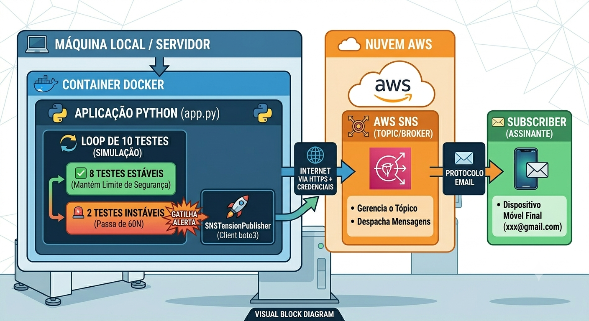

# Simulador de Processo de Otimização de Parâmetros PID com AWS SNS

Este projeto implementa um simulador de sensores industriais voltado para o monitoramento e otimização de parâmetros de um controlador PID (Proporcional, Integral e Derivativo) aplicado ao controle de tensão. O sistema adota uma arquitetura do tipo Publisher/Subscriber (Pub/Sub) integrada ao serviço AWS SNS (Simple Notification Service) para o disparo de alertas caso os limites de segurança sejam violados.

## 🛠️ Arquitetura do Sistema (Pub/Sub + IA)

O projeto utiliza um padrão arquitetural desacoplado e orientado a eventos:
1. Publisher (Container Docker): Executa o loop principal em Python (app.py), gera leituras e monitora o limite de segurança ($50\text{N} \pm 20\%$).
2. Camada de Tradução (Amazon Translate): Ao detectar que o limite de 60N foi violado, o script invoca dinamicamente o serviço de IA para traduzir o payload baseado na preferência do usuário.
3. Broker (AWS SNS): Recebe a mensagem internacionalizada e despacha para a lista de assinantes cadastrados.

## 📂 Estrutura de Arquivos

O diretório do projeto é composto pelos seguintes arquivos:

* **main.py**: Contém o código-fonte principal da aplicação. Ele engloba a classe do simulador do sensor (com comportamento de *random walk*, tendência e picos residuais), a implementação matemática do controlador PID, a classe publicadora do AWS SNS e o *loop* que gerencia e executa as diferentes configurações de parâmetros para os testes.
* **requirements.txt**: Lista as dependências externas necessárias para a execução do projeto. Neste caso, inclui a biblioteca `boto3`, que é o SDK oficial da Amazon Web Services para Python.
* **Dockerfile**: Arquivo de configuração contendo as instruções para a criação da imagem Docker isolada, garantindo que a aplicação rode com as mesmas versões de dependências em qualquer ambiente.

```text
teste_pid_aws_simplificado/
├── .env                  # Arquivo de credenciais (Não versionar!)
├── Dockerfile            # Construção da imagem Docker
└── main.py                # Código-fonte da aplicação com Boto3
```

---

## 📋 Pré-requisitos

Antes de iniciar, certifique-se de ter instalado em sua máquina:
1. Docker Desktop (ativo e em execução).
2. Uma conta AWS com um Tópico SNS do tipo *Standard* configurado e uma assinatura ativa (E-mail ou SMS) vinculada a ele.
3. Chaves de acesso de um usuário IAM com permissão de publicação no SNS (`AmazonSNSFullAccess`).

---

## 🚀 Como Executar o Projeto: Passo a Passo

### Passo 1: Configurar as Variáveis de Ambiente
Na raiz da pasta do projeto, crie um arquivo chamado exatamente `.env`. Abra este arquivo em um editor de texto e preencha-o com as suas credenciais reais da AWS e o identificador único do seu tópico:

```text
AWS_ACCESS_KEY_ID=SUA_ACCESS_KEY_AQUI
AWS_SECRET_ACCESS_KEY=SUA_SECRET_KEY_AQUI
AWS_REGION=us-east-1
AWS_SNS_TOPIC_ARN=arn:aws:sns:us-east-1:123456789012:Alerta-Tensão-PID
```
### Passo 2: Construir a Imagem Docker 
Abra o seu terminal ou PowerShell, navegue até a pasta do projeto e execute o comando abaixo para realizar o build da imagem customizada:
```docker 
docker build -t simulador-pid-aws .
```  

### 3. Executar o Sistema Definindo o Idioma
Para rodar a aplicação injetando o arquivo de configuração e escolhendo o idioma desejado para receber o alerta, use o comando de linha única 
correspondente ao seu terminal:
* **Em qualquer terminal (Linha única recomendada):**
```bash
docker run --rm --env-file .env -e TARGET_LANGUAGE="de" simulador-pid-aws-simplificado
```

**Códigos de idiomas suportados pelo parâmetro `-e TARGET_LANGUAGE="..."`:**

* `"de"` - Alemão 🇩🇪

* `"en"` - Inglês 🇺🇸

* `"es"` - Espanhol 🇪🇸

* `"fr"` - Francês 🇫🇷

* *Se omitido, o sistema adotará o Português (`"pt"`) por padrão.*

---

Aqui está o guia definitivo passo a passo para configurar toda a infraestrutura necessária na sua conta AWS, garantindo que o **AWS SNS** (Broker de Mensagens) e o **Amazon Translate** (Serviço de Tradução) conversem perfeitamente com o seu container.
---

## 🛠️ Parte 1: Criando e Configurando o AWS SNS (Tópico)

Para receber as mensagens no seu e-mail ou celular, primeiro precisamos criar o "canal" de distribuição na AWS.

### Passo 1.1: Criar o Tópico

1. Acesse o **Console de Gerenciamento da AWS**.
2. Na barra de pesquisa superior, digite **SNS** e clique em **Simple Notification Service**.
3. No menu lateral esquerdo, clique em **Tópicos** (*Topics*) e depois no botão **Criar tópico** (*Create topic*).
4. Em **Tipo** (*Type*), selecione a opção **Padrão** (*Standard*).
5. No campo **Nome** (*Name*), digite um nome de sua preferência (ex: `alertas-tensao-planta`).
6. Deixe o restante como está, role até o final da página e clique em **Criar tópico**.
7. **Importante:** Na página que se abrir, localize o campo **ARN** (ex: `arn:aws:sns:us-east-1:123456789012:alertas-tensao-planta`) e copie esse código. Ele irá direto para o seu arquivo `.env`.

### Passo 1.2: Adicionar um Assinante (Seu E-mail)
O tópico foi criado, mas ele precisa saber para quem enviar os alertas.
1. Ainda na página do tópico que você acabou de criar, role até a aba **Assinaturas** (*Subscriptions*) e clique em **Criar assinatura**.
2. No campo **Protocolo** (*Protocol*), selecione **E-mail** (ou *SMS*, se sua conta permitir).
3. No campo **Endpoint**, digite o seu endereço de e-mail real (ex: `seu-email@gmail.com`).
4. Clique em **Criar assinatura**.
5. ⚠️ **Ação Obrigatória:** Abra a caixa de entrada do e-mail que você cadastrou. Você receberá um e-mail da AWS com o assunto *AWS Notification - Subscription Confirmation*. Abra o e-mail e clique no link **Confirm subscription**. Se você não fizer isso, a AWS bloqueará os envios do Docker para você.
---
## 🧠 Parte 2: Ativando o Amazon Translate
Como vimos anteriormente, serviços de Inteligência Artificial precisam ser "despertados" na conta para liberar o faturamento e as chaves de acesso.
1. Na barra de pesquisa superior da AWS, digite **Translate** e clique em **Amazon Translate**.
2. No menu esquerdo, certifique-se de que está na mesma região do seu arquivo `.env` (ex: *N. Virginia / us-east-1*).
3. Clique em **Tradutor de texto** (*Text Translation*) no menu lateral.
4. Na tela que aparecer, digite qualquer frase na caixa da esquerda (ex: *"Teste de sistema"*) e certifique-se de que a tradução ocorra com sucesso na caixa da direita.
5. *Pronto! Esse simples teste em tela ativa a API do Translate para o seu usuário.*
---
## 🔐 Parte 3: Configurando as Permissões no IAM (Chaves de Acesso)
Agora precisamos garantir que o usuário que gerou a sua `AWS_ACCESS_KEY_ID` e `AWS_SECRET_ACCESS_KEY` tenha o direito de usar o SNS e o Translate ao mesmo tempo.
1. Na barra de pesquisa superior da AWS, digite **IAM** (Identity and Access Management).
2. No menu lateral esquerdo, clique em **Usuários** (*Users*).
3. Clique no nome do usuário cujas chaves de acesso você colocou no arquivo `.env`.
4. Na aba **Permissões** (*Permissions*), clique no botão azul **Adicionar permissões** (*Add permissions*) e selecione **Adicionar permissões diretamente** (*Attach policies directly*).
5. Na barra de pesquisa de políticas, procure por **SNS** e marque a caixinha da política:
* **`AmazonSNSFullAccess`** (Permite enviar mensagens para o tópico).
6. Limpe a pesquisa, procure por **Translate** e marque a caixinha da política:
* **`TranslateReadOnly`** (Permite fazer traduções de texto).
7. Clique em **Próximo** (*Next*) e depois em **Adicionar permissões** (*Add permissions*).
---
## 🚀 Tudo Pronto!
Agora que a AWS está 100% configurada:
1. O seu **Tópico SNS** está ativo e aguardando mensagens.
2. O seu **E-mail** está confirmado para receber os alertas.
3. O **Amazon Translate** está acordado.
4. O seu **Usuário IAM** tem os superpoderes necessários para rodar ambos.
---
### 📈 Descrição do Cenário de Simulação
O controlador PID gerencia um processo cujo objetivo é estabilizar a tensão no setpoint fixo de 50N, sob uma velocidade operacional constante de 17 mm/s.

- Regra de Negócio: O sistema monitora a tensão em tempo real (passos de 100ms) durante ciclos de 10 segundos para cada conjunto de parâmetros PID testados.

- Alerta de Segurança: Se em qualquer momento a tensão medida desviar mais de 20% do valor desejado (ou seja, se ficar abaixo de 40N ou acima de 60N), o componente Publisher é imediatamente acionado, despachando uma notificação de erro para o Broker AWS SNS, que por sua vez entrega o alerta aos assinantes cadastrados.



